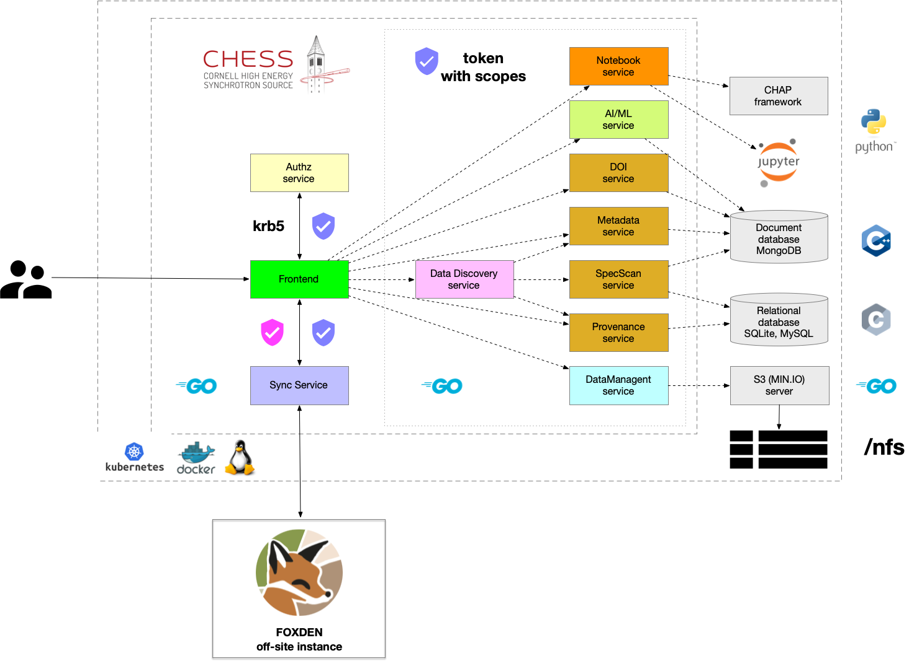

# Architecture
## FOXDEN services
FOXDEN infrastructure is based on loosely coupled services, and properly
layered/insulated as shown in the following diagram:

Users communicate with FOXDEN through secure web UI and CLI interfaces. Each user
is authenticated and obtains an authorization token from the
[Authn/Authz Service](authz.md). Each token carries the username and scope
associated with user, which allows them to communicate with
individual FOXDEN services. 

In keeping with FOXDEN’s modular design, each data product is self-contained.
For example, metadata and provenance records are not structurally linked via foreign keys;
they are only cross-referenced through common [Dataset IDentifiers (DIDs)](did.md) stored in each record.
As a result, dependencies among data products are reduced, allowing services to be
invoked independently, instead of through prescribed workflows.

All communication between services is done via the HTTP protocol with
JSON payloads. For instance, a client can inject new data or user
can look-up some information from FOXDEN via HTTP request.

Currently the following services are implemented:
- [Frontend Service](web.md): web interface for end-users
- [Command line (CLI) tool](cli.md)
- [Authn/Authz Service](authz.md): provides authentication and authorization of end-users
- [Data Discovery Service](discovery.md): aggregates records and datasets associated with a given DID
- [Metadata Service](metadata.md): repository of metadata describing raw, reduced, and analyzed datasets
- [Provenance Service](provenance.md): repository of provenance information for datasets in the Metadata Service
- [Data Management Service](datamgt.md): catalog of logical datasets in the Metadata Service
- [DOI Publication Service](publication.md): mints DOIs for metadata and provenance records
- [SpecScan Service](specscan.md): repository of logs for the X-ray data acquisition program, [spec](https://www.certif.com)
- [AI/ML Service](mlhub.md): AI/ML workflow management system
- [Notebook Service](notebook.md): Jupyter-like coding environment and repository for data analysis modules

## FOXDEN configuration
All services share a single file as FOXDEN configuration
which organizes everything in corresponding blocks. Each
configuration block is responsible for individual FOXDEN
service configuration. For more details see
FOXDEN [configuration](configuration.md).
