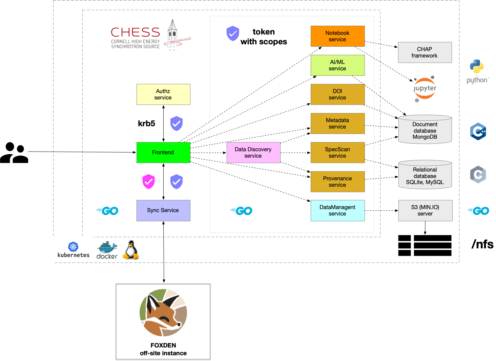
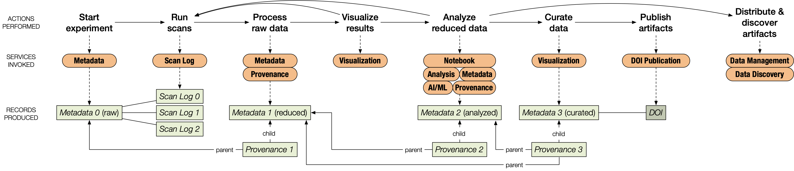

# FOXDEN current system
FOXDEN infrastructure is based on loosely couple services, see

A user communicate through a secure channel with all of them
either view web UI or CLI interfaces. Initially, each user
is authenticated and obtain authorization token from
[Authz](authz.md) service. Each token carry user name and scope
associated with user which allow (s)he to communicate with
individual FOXDEN services. The coupling between FOXDEN services
is done via [Dataset IDentifier (did)](did.md) which is presented
in each individual FOXDEN service. For instance, once user
look-up desired meta-data it has did in it which can be used
to look-up its provenance information and even publish desired
dataset in Publication service.

All communication between services is done via HTTP protocol with
JSON payload. For instance, a client can inject new data or user
can look-up some information from FOXDEN via HTTP request.

Currently the following services are implemented:
- [Frontend service: web interface](web.md), deployed on port 8344
- [Command line (CLI) tool](cli.md)
- [Authentication and authorization service](authz.md), deployed on port 8380
- [Data Discovery service](discovery.md), deployed on port 8320
- [MetaData service](metadata.md), deployed on port 8300
- [Provenance service](provenance.md), deployed on port 8310
- [Data Management service](datamgt.md), deployed on port 8340
- [Publication service](publication.md), deployed on port 8355
- [SpecScan service](specscan.md), deployed on port 8390
- [MLHub](mlhub.md), deployed on port 8350
- [CHAP Notebook](notebook.md), deployed on port 8181

Please see the following diagram how these services are
integrated with each other:

### FOXDEN configuration
All services share a single file as FOXDEN configuration
which organizes everything in corresponding blocks. Each
configuration block is responsible for individual FOXDEN
service configuration. For more details see
FOXDEN [configuration](configuration.md).

### CHESS integration
The FOXDEN services are deployed to CHESS and cover the
following workflow

