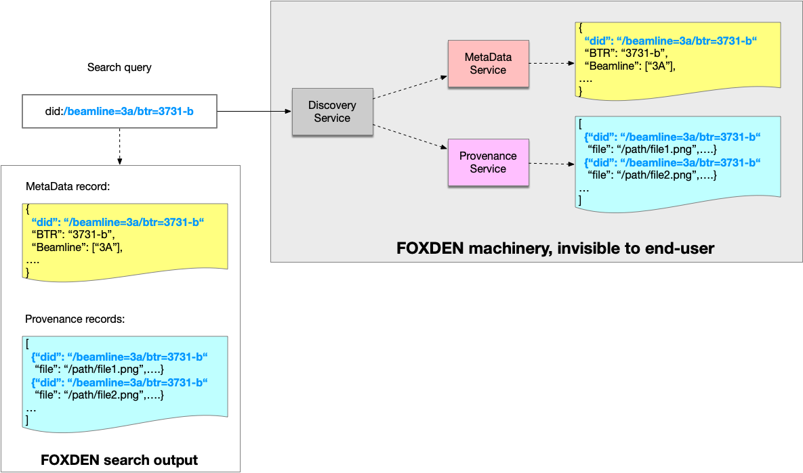

# Dataset IDentifier
The Dataset IDentifier (DID) is a unique identifier for the CHESS/FOXDEN
dataset. It may be represented in two different forms:

- as a JSON record with key-value pairs, for example:
```
{
    "key1": "value1",
    "key2": "value2",
    ...
}
```


- or, as a human-readable string which is a composition of different key-value
  pairs separated by a dedicated character, where their placement follows
  alphabetically sorted keys, for example:
```
/key1=value1/key2=value2/...
```

### Additional constraints:
- Choice of characters in key-value pairs: We suggest choosing one common
  notation, for instance, lowercase keys and values, with no empty spaces. If
  an empty space is required by a value, it should be replaced by an underscore
  value. Therefore, if the user chooses BTR and Beamline keys to define a
  dataset, their string representation can be identified as follows:
  `/beamline=value/btr=value`.

- Use the slash character, i.e., `/`, as a separator and the equal character,
  e.g., `=`, as a divider between key and values. The choice of `=` versus `:`
  is preferable since the latter is already used in the MetaData service for
  query purposes and to avoid possible parsing problems. For example, in
  MetaData queries, we use `:` as a separator between key and a value;
  therefore, parsing `did:/key=value` user query will be resolved into `{"did":
  "/key=value"}`, while parsing `did:/key:value` becomes difficult to implement
  due to multiple meanings of a separator.

<br/>

## DID Placement in CHESS/FOXDEN Workflows and Services

The CHESS/FOXDEN dataset becomes live once a new metadata record is recorded in
the MetaData service. At this point, users or user workflows may specify a DID
value, provide a list of attributes to construct it from, or rely on underlying
tools, libraries, or services to use default attributes (e.g., `beamline`,
`btr`, `cycle`, `sample`).

<br/>

Each metadata record describes the conditions of a specific experiment and the
data collected at CHESS beamlines. These records adhere to a predefined schema
and are validated against predefined data types. Thus, we offer a flexible way
to define a DID using any set of key-value pairs presented in the metadata
record. Therefore, users or user workflows have three possibilities:

1. Specify the DID value within the metadata record itself (the corresponding key is `did`).
2. Provide a comma-separated list of attributes to define a DID, e.g., `key1,key2,...`.
3. Allow the underlying service/tool to use defaults, e.g., `beamline,btr,cycle,sample`.

<br/>
Here is an example of metadata insertion using **foxden** command line tool:
<br/>


<br/>

Please note that CHESS metadata records follow the CamelCase keys convention,
while we suggest using lowercase keys and values in the DID string
representation or construction (which will be done by underlying software).

<br/>

Once the DID is defined and recorded within the metadata record, it will be
used in other services such as Provenance, Data Management, SpecScans, and Data
Discovery to relate other information to it. For instance, the Provenance
service can associate the DID with software versions and lists of files, among
other details. The Data Management service will know how to map collections of
files or blob chunks into a dataset, while the SpecScans service will provide a
mapping between the DID and specific motor positions used during the
experiment.

<br/>

During a lookup via Data Discovery, users can specify the DID to find details
about a specific dataset.

<br/>

### Dataset Relationships

The DID format (presented as a series of key-value pairs) provides a flexible
format to define derived data and establish necessary relationships between
different datasets.

For example, if a raw dataset is defined as:

```
/aaa=value/bbb=value
```
then a derived dataset can be identified using the following DID:

```
/aaa=value/bbb=value/datatier=derived
```

The derived dataset may or may not have its own metadata record. But it will
allow to setup parent child relationship in Provenance service between the two,
e.g.

```
# the dataset
/aaa=value/bbb=value/datatier=derived
# will have parent dataset
/aaa=value/bbb=value
```

This will allow to setup (complex) finite graph relationships, e.g.
```
DatasetA -> DatasetB -> DatasetC
         \              ^
          \            /
           \-> DatasetX

# here
# DatasetA is a parent of DatasetB and DatasetX
# DatasetC is a child of DatasetB and DatasetX
```


In either case, the Data Discovery service can look up the relationship between
two dataset DIDs and find out the original metadata record.

<br/>

### Usage of DID in search queries
Here is how we envision the system will work:
- a user place a query to FOXDEN frontend
- the query is sent to Data Discovery service
- the Data Discovery service convert query into spec and send request to FOXDEN
  services, like MetaData, Provenance, Spec Scan, etc.
- it retrieves results and present them to end-user
- optionally we may add aggregation to final result set and merge them together

<br/>

Here is pictorial representation of this workflow:

