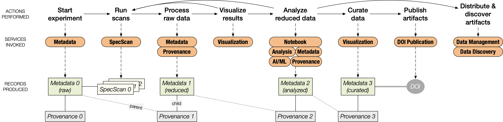

# Introduction

The **FAIR Open-Science eXtensible Data Exchange Network (FOXDEN)** is a set of cyberinfrastructure (CI) building blocks developed at the [Cornell High Energy Synchrotron Source (CHESS)](https://www.chess.cornell.edu/) for managing research artifacts, such as metadata and provenance for raw/reduced/analyzed datasets, data analysis code, visualizations, and AI/ML models. FOXDEN is specifically designed to handle large, unportable datasets and heterogenous use cases. It helps scientists turn their research artifacts into annotated, AI-ready datasets and publish them with Digital Object Identifiers (DOIs) for compliance with [FAIR principles](https://www.go-fair.org/fair-principles/).

FOXDEN is not a data acquisition or workflow orchestration system. Instead, it is an ecosystem of **loosely coupled services** that shadow the existing research systems and workflows at CHESS, selectively augmenting them with record-keeping capabilities.

## Key Features

FOXDEN is designed to facilitate **collaborative reuse of scientific data**. Its design prioritizes the heterogeneity needed for high-impact, data-intensive science. Researchers can use FOXDEN to search for datasets, retrieve metadata, and analyze data locally or remotely, enabling streamlined cross-facility collaboration. FOXDEN supports customizable workflows and can be integrated with diverse data storage solutions and federated CI resources.

The figure above shows the actions performed in a typical research workflow at CHESS, along with the FOXDEN services invoked at each step. During an experiment, the X-ray data acquisition (DAQ) system writes the raw dataset to the CHESS-DAQ filesystem while inserting corresponding metadata and scan log records into the Metadata Service and Scan Log Service. These records contain information (e.g. motor positions) that is automatically extracted from the DAQ, although some (e.g., specimen descriptions) is entered by researchers when prompted. When raw data is processed into a reduced dataset, the job script inserts corresponding metadata and provenance records into the Metadata Service and Provenance Service to identify and link the parent (raw) and child (reduced) datasets. Similarly, when the reduced dataset is further analyzed, additional metadata and provenance records are added to the chain of FOXDEN records. FOXDEN metadata and provenance records are cross-referenced through common dataset identifiers (DID) stored in each record.

These workflow steps can be repeated or iterated as desired, and new metadata and provenance records will be created to document each step. When a step is repeated, the linear chain of FOXDEN records bifurcates into a branching tree structure, with multiple child records attached to a single parent record.

FOXDEN's DOI Publication Service allows users to publish any or all of the metadata and provenance records associated with a particular DID. For example, users may choose to publish only a single dataset in the tree, a single branch of the tree, or the whole tree in its entirety under a single DOI. The DOI Publication Service mints DOIs for FOXDEN records using a variety of common DOI providers, such as [DataCite](https://datacite.org/), [Zenodo](https://zenodo.org/), and [Materials Commons](https://materialscommons.org/). Note that, because of their size, the CHESS datasets themselves are not uploaded to the DOI providers. Rather, the published metadata records point to the locations of data stored persistently at CHESS.

## Technical Design

FOXDEN services are **web applications written in Go**, offering **RESTful HTTP
APIs** that allow seamless data interactions without requiring specialized
client software. These services handle structured and unstructured data using
both relational and document-oriented databases, ensuring **scalability,
fault-tolerance, and long-term sustainability**. 
Clients can choose which FOXDEN services should be deployed at their
premises and easily integrate them within existing infrastructure.

A strong emphasis on **cybersecurity** ensures that FOXDEN integrates industry
best practices. Web interfaces and APIs are secured with encryption and
token-based authentication. Each token carries specific scopes for
fine-granularity access to underlying data and operations.
