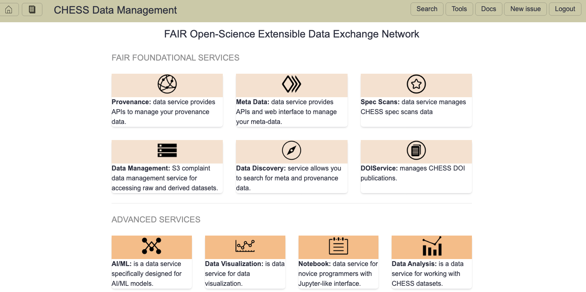
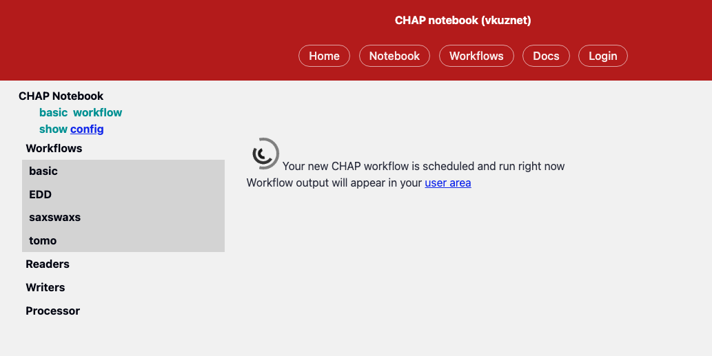

# CHAP Notebook service
The CHAP notebook service is Designed for novice programmers, this service
simplifies data analysis by giving users a Jupyter-like interface for writing
code modules that are inserted into pre-defined workflows.

It is accessible from FOXDEN services page (see Notebook link):

and it consists of login page where user should proceed with his/her Github
account:

After successfull authentication via Github the user will be presented with
fully integrated CHAP notebook:

The user should choose a specific configuration along with provided
reader, writer, processor and upon execution of user code you'll be presented
with the following workflow status page:

Finally, upon successfull completion of your workflow you'll get result page
which will navigate user to various places related with your workflow:

