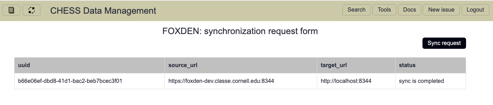

# Sync service

[SyncService](https://github.com/CHESSComputing/SyncService)
is designed to sync FOXDEN records between distributed FOXDEN instances.
Its logic is based on individual synching of metadata and provenance records
between instances.

## Web interface
Sync web interface consiste of submission form 

and status dashboard


## APIs
- GET methods
  - `/records` to fetch all sycn records
  - `/request/*record` to fetch individual sync record
- POST methods:
  - `/request` to add new sync record
- PUT methods:
  - `/request/*record` to amend already existing sync record
- DELETE methods:
  - `/request/*record` to delete sync record

### Example uses
- Add new records:
  ```
  curl -X POST
    -H "Content-type: application/json" \
    -H "Authorization: Bearer $token" \
    -d '{"source_token":"token", "target_token":"token", "source_url": "https://foxden...", "target_url": "http://localhost:8344"}"
    http://localhost:8388/request
  ```
- Fetch all sync records:
  ```
  curl \
    -H "Content-type: application/json" \
    -H "Authorization: bearer $token" \
    http://localhost:8390/records
  ```
