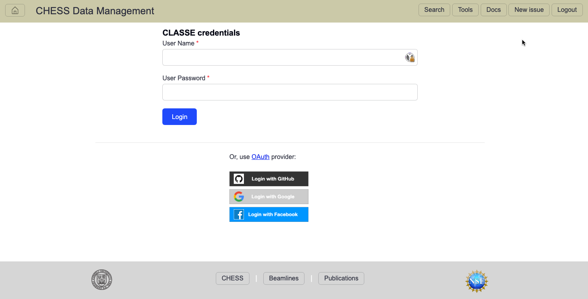
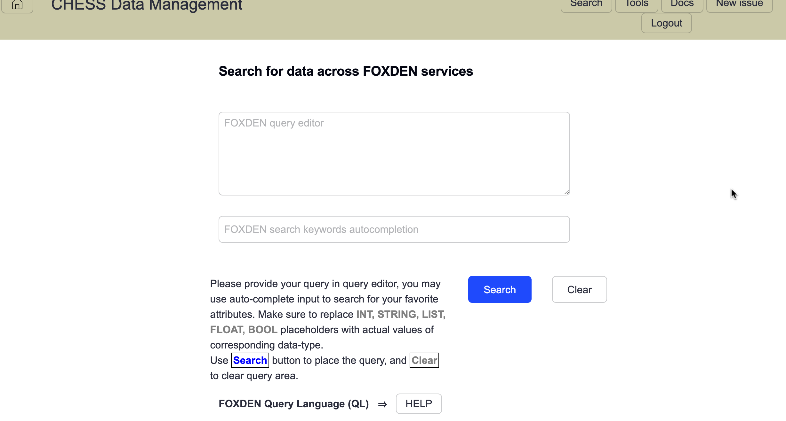
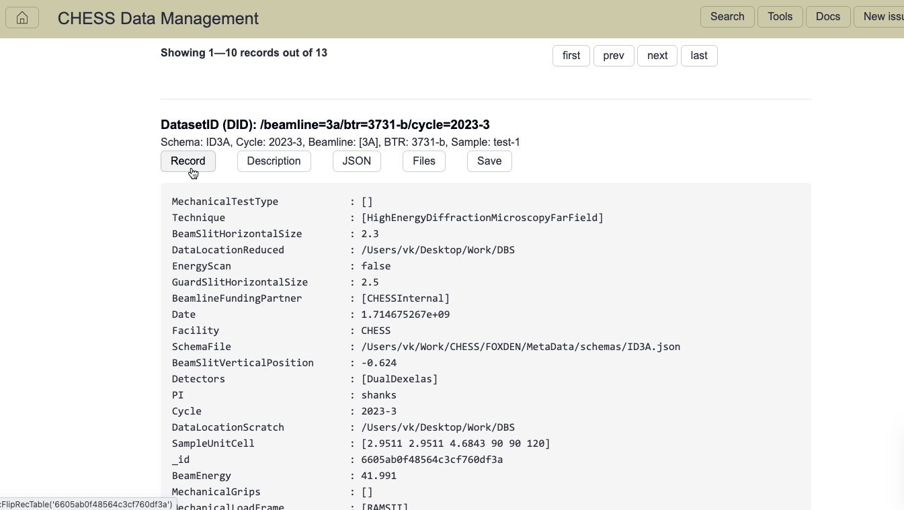
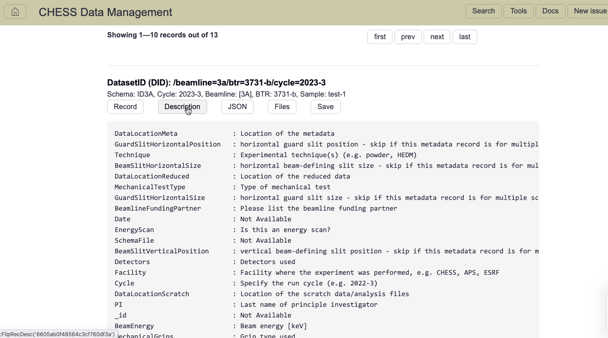
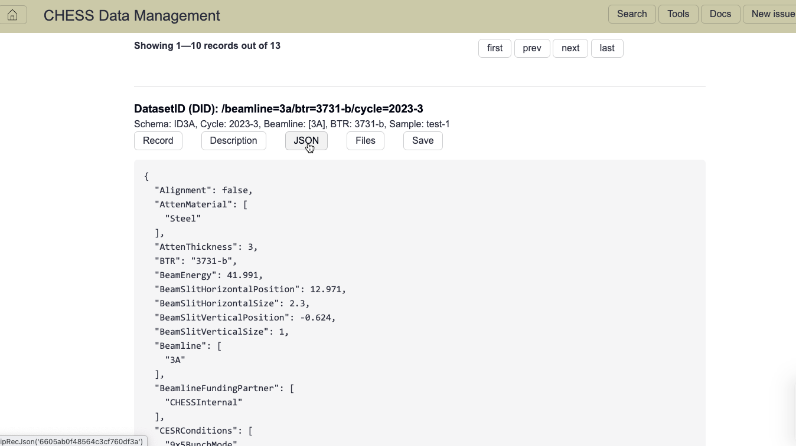

# FOXDEB web interface
The FOXDEN web interface is simple and intuitive. Here we'll walk you through
its main components.

<br/>

### Login page
When you first time login to FOXDEN server you will be prompted to provide
your CHESS Kerberos credentials. Please note FOXDEN does not store them
anywhere and only obtain a valid kerberos ticket using your credentials and
create associated [token](/docs/tokens.md).



<br/>

### Main page
The FOXDEN main page contains set of widgets to naviate your through
FOXDEN services. If you are CHESS user who only need to look at
(meta|provenance) data you will only need a **Discovery page**. For other
use cases please navigate to appropriate FOXDEN service.


<br/>

### Documentation page
The FOXDEN documentation page is very well organized and provide enough
materials to get you started.


<br/>

### FOXDEN search
FOXDEN search interface page allows user to search for the favorite FOXDEN
(meta|provenance) data records using either key-value pairs, or fully featured
FOXDEN Query Language (QL):


<br/>

The FOXDEN search interface consists of two pars:
- FOXDEN query editor
- FOXDEN search keywords autocompletion

In former one you may place your JSON query, the later allows you to
search for FOXDEN keys and compose your query.

<br/>

Please use **HELP** button to get more examples. It will show you the
following:
```
# fetch all records
{}
```
The above query will look up all records in FOXDEN using `{}` query.

```
# search for specific key:value pair where "key" is your record key
# and "123" is your record value (can be any data-type):
{"btr":"3731-b"}
or use multiple conditions
{"beam_energy": 41.1, "btr": "3731-b"}
```
In this case only records which match provided conditions will be shown.

The query language also supports variety of mathematical operations like:
- support for greater/less then conditions:
```
# search for specific condition using operators:
{"atten_thickness": {"$gt": 3}}
```
- support for regular expression patterns:
```
# search using regex patterns:
{"did":{"$regex":"/beamline=3a/btr=3731-b.*"}}
```
- and combinations of the above queries
```
# make complex queries
{
   "did":{"$regex":"/beamline=3a/btr=3731-b.*"},
   "beam_energy": 41.1,
   "atten_thickness": {"$gt": 3}
}
```
For more information about used query language please use
[MongoDB QL](https://www.mongodb.com/docs/manual/tutorial/query-documents/).

<br/>

Once you found what you want you will be redirected to FOXDEN records page.
This page may contain one or more records reflected to your search query.

<br/>

#### FOXDEN records


<br/>

Each record can be viewed in different forms:
- tabular format to see table like key:value pairs
- desciption format to provide you information about meaning of each key
- and JSON data-format for you to grab and go on

Below you can see examples of each invidual record representation:

<br/>

#### Record tabular format


<br/>

#### Record record description


<br/>

#### Record JSON format

