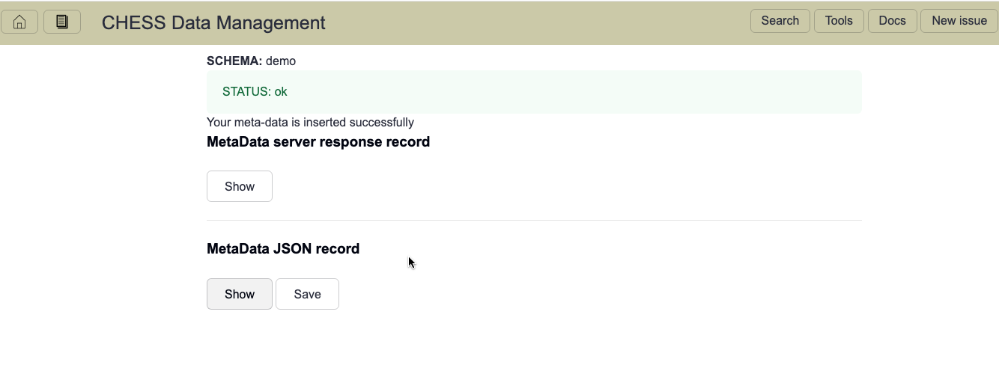
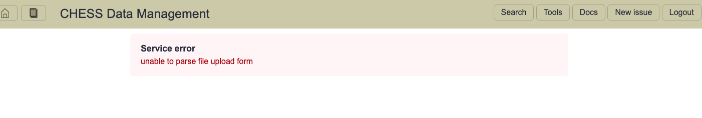
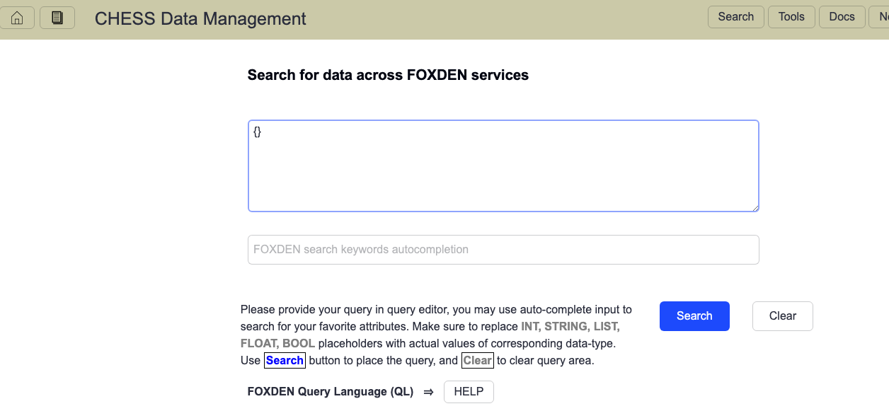

## FOXDEN web tutorial
In this tutorial we will walk through
[FOXDEN infrastructure](https://chesscomputing.github.io/FOXDEN/docs/introduction.html).
[Current system](https://chesscomputing.github.io/FOXDEN/docs/current-system.html)
consists of loosely coupled services which helps you organize your (meta-) data
and provide traceability of your analysis workflows from acquiring the data to
final physics analysis, including DOI publication.

FOXDEN provides web UI and Command Line Interface (CLI).

### FOXDEN web interface
For our tutorial we will use a demo version of FOXDEN infrastructure.
We will also rely on set of pre-populated records available at
[FOXDEN demo repository](https://github.com/CHESSComputing/FOXDEN/tree/main/demo)

To proceed please navigate to this foxden-demo URL and follow these steps:

#### Authentication page
First time you access FOXDEN you'll be prompted for your
CLASSE credential via FOXDEN authentication page:

#### Main (dataset table) page
After that, you will be navigated to main FOXDEN
page which will show available datasets:

#### Services page
FOXDEN provides many services which are available from services page

#### Metadata service
One of the many FOXDEN services is Metadata services. It provides a web
form to inject your metadata record:

Once we'll inject the metadata record you'll be given
either *success* or *failure* pages. 

Here is an example of success page(s) where you can see your record details:

On failure page you'll be given some details of failed injection

#### Search page
On FOXDEN search page you will be prompted to provide your query

And, there is a minimal help to get you started

A simple FOXDEN query is `{}` which means no conditions and it
return all metadata record

For more complicated query please refer to help section of search page

#### Results page
This is an example of results page showing few metadata records

